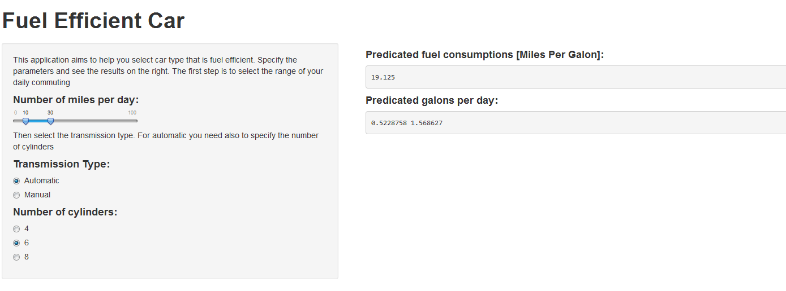

## Motivation

<h2> How to select fuel efficient car?</h2>
<h2> What is better automatic or manual car?</h2>
<h2> What is my expected fuel consumption per day?</h2>

--- .class #id 

## The solution
</img>

<a href="https://giladsa.shinyapps.io/FuelEfficientCar/">Try it</a> and you will find the answers to your questions

--- .class #id 

## The model

The predications are made based on a liner model that developed from "mtcars" dataset

```{r block2, fig.width=8, fig.height=5}
data(mtcars); 
d<-mtcars;#loading data
d$am <- factor(d$am,levels=c(0,1),labels=c("Automatic","Manual")) 
d$cyl <- factor(d$cyl) 
fit <- lm(mpg ~ am+am*cyl,d) #fitting liner model
predict(fit,data.frame(cyl = "6",am="Automatic"))

```

--- .class #id 

## Use the application

1. If you have NOT tried it yet, <a href="https://giladsa.shinyapps.io/FuelEfficientCar/">go and try it</a>
2. It is a simple and intuitive application
3. It is based on analytics :)
4. It can save you a lot of money and make our world greener

